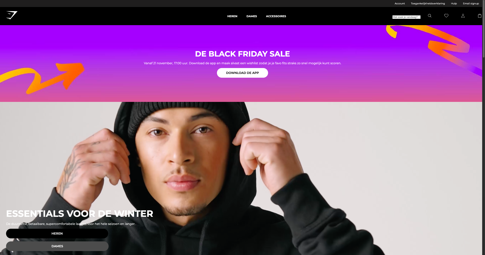
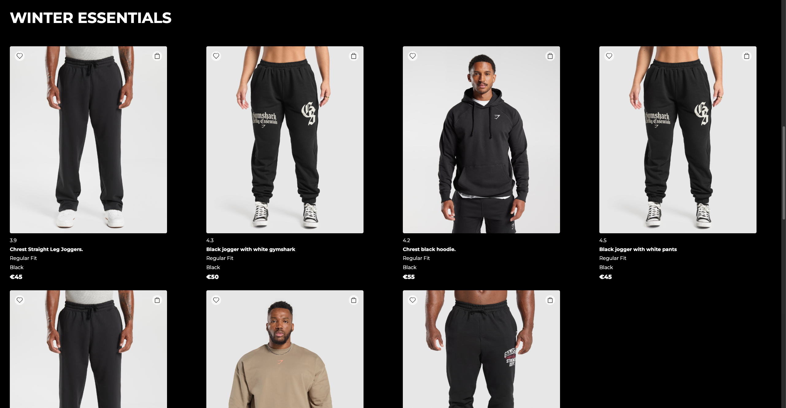
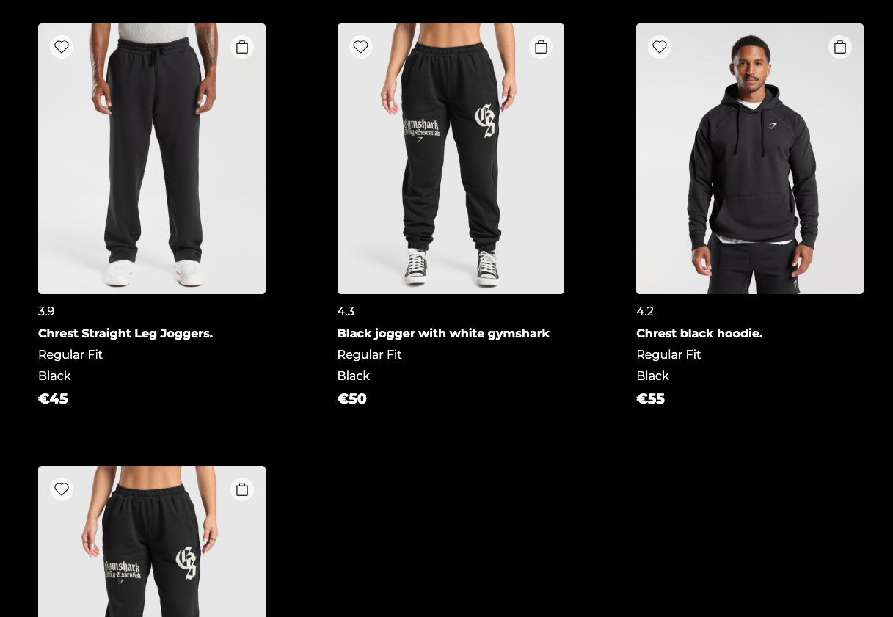
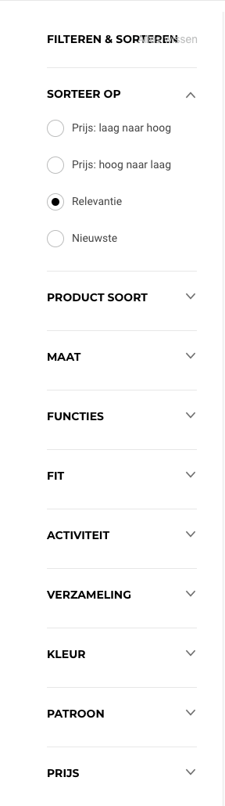
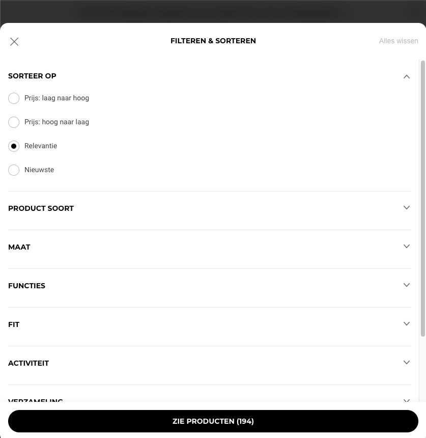

# Procesverslag
Markdown is een simpele manier om HTML te schrijven.  
Markdown cheat cheet: [Hulp bij het schrijven van Markdown](https://github.com/adam-p/markdown-here/wiki/Markdown-Cheatsheet).

Nb. De standaardstructuur en de spartaanse opmaak van de README.md zijn helemaal prima. Het gaat om de inhoud van je procesverslag. Besteedt de tijd voor pracht en praal aan je website.

Nb. Door *open* toe te voegen aan een *details* element kun je deze standaard open zetten. Fijn om dat steeds voor de relevante stuk(ken) te doen.

## Jij

  
uitwerken voor kick-off werkgroep

  ### Auteur:
  Mick van der Linden

  #### Je startniveau:
  Blauw

  #### Je focus:
Responsive
 

## Je website

  
uitwerken voor kick-off werkgroep

  ### Je opdracht:
 https://nl.gymshark.com

  #### Screenshot(s) van de eerste pagina (small screen):   
  Home pagina
  

  #### Screenshot(s) van de tweede pagina (small screen):
  Heren pagina (shop)
  
 

## Toegankelijkheidstest 1/2 (week 1)

  
uitwerken na test in 2e werkgroep

  ### Bevindingen

1 Content
De tekst op de website is duidelijk en gemakkelijk te begrijpen zonder gebruik van aparte taal.
Beschrijvingen van producten zijn vrij kort en kan problematisch zijn voor mensen die een visuele beperking hebben, in de alt text van de afbeelding staat zelfs niet welke kleur een broek is.
2 Global code
Er wordt slecht gebruik gemaakt van de headings, dit zijn div in plaats van bijvoorbeeld een h2
3 Keyboard
Alle interactieve elementen, zoals knoppen en links, kunnen goed worden bediend via het toetsenbord. De focusstatus is niet altijd zichtbaar wanneer gebruikers via het toetsenbord navigeren, wat het moeilijk maakt om te zien welk element geselecteerd is.
4 Images
De meeste afbeeldingen bevatten een alt-tekst die de inhoud van de afbeelding beschrijft. Bij sommige plaatjes staat de heading als alt tag in de image waardoor je niet weet wat het plaatje is.
5 Headings
De headings zijn niet goed gestructureerd. De hoofdtitel van de pagina zit in een banner, dit klopt niet. Verder zijn er meerdere H1 elementen wat niet mogelijk is.
6 Lists
De website gebruikt lijststructuren (zoals ul en li) op een goede manier, bij items zie je eerst een ul als parent en dan li items als children.
7 Controls
Knoppen en links zijn duidelijk gemarkeerd, en hun functionaliteit is direct herkenbaar. De elementen hebben een duidelijke focus status bij het navigeren met het toetsenbord.
8 Media
De video's op de website kunnen gepauzeerd worden, en de bedieningsknoppen zijn duidelijk zichtbaar. Wel spelen deze video's automatisch al af wat vervelend kan zijn voor iemand die veel prikkels binnenkrijgt.
9 Appearance
Het ontwerp van de website is eenvoudig, overzichtelijk en consistent, wat het voor gebruikers gemakkelijk maakt om te navigeren, soms is er wel sprake van tekst op een achtergrond wat vervelend kan zijn voor mensen die snel geprikkeld zijn.
10 Animation
De animaties op de website zijn erg klein en subtiel, je kunt zelfs een aantal animaties op pauze zetten wat zorgt voor meer rust in de pagina.
11 Color Contrast
De tekst op de website heeft over het algemeen goed kleurcontrast, wat de leesbaarheid vergroot. Het contrast van de heading en de video is als enige niet geweldig te zien, maar de rest complimenteert erg goed aan elkaar.
12 Mobile and Touch
De website schaalt goed op mobiele apparaten en past zich aan verschillende schermformaten aan. De volgorde verandert wel heel erg van de navigatie wat voor de gebruiker verwarrend kan zijn.

De Gymshark-website heeft duidelijke tekst, maar productbeschrijvingen en alt-teksten missen soms belangrijke details. Headings zijn slecht gestructureerd en niet correct gecodeerd. Keyboardnavigatie werkt grotendeels goed, maar de focusstatus ontbreekt soms. Afbeeldingen bevatten onjuiste alt-tags, en video's spelen automatisch af, wat prikkelend kan zijn. Het kleurcontrast is overwegend goed, maar sommige tekst-over-achtergrond combinaties zijn onduidelijk. De mobiele weergave is responsive, maar kan verwarrend zijn door veranderde navigatievolgorde. De animaties zijn subtiel en te pauzeren. Over het algemeen biedt de website ruimte voor verbeteringen.

 

## Breakdownschets (week 1)

  
uitwerken na afloop 3e werkgroep

  ### de hele pagina: 
  

  ### dynamisch deel (bijv menu): 
  

  ### wellicht nog een dynamisch deel (bijv filter): 
  

## Voortgang 1 (week 2)

  
uitwerken voor 1e voortgang

  ### Stand van zaken
     
  Ik vond het moeilijk om met een nested ul li list te werken

  ### Verslag van meeting
  hier na afloop snel de uitkomsten van de meeting vastleggen
* H1 onzichtbaar op de website
* Hierarchie headings verbeteren h1 h2 etc.
* Verschil weten tussen a href en button
* Input = search voor de zoekbalk
* Minder gebruik maken van article en gebruik maken van ul en dan list items
* Position komt nog in de les voor het verplaatsen van nav
* Summary and details voor dropdownmenu

## Voortgang 2 (week 3)

  
uitwerken voor 2e voortgang

  
 Het was moeilijk om het menu responsive te maken van dekstop naar mobiel.
  ### Stand van zaken
  
  ### Verslag van meeting
  hier na afloop snel de uitkomsten van de meeting vastleggen

  - Aria label gebruiken bij hamburgermenu
  - Beter structureren van headings

## Toegankelijkheidstest 2/2 (week 4)

  
uitwerken na test in 9e werkgroep

  ### Bevindingen
1 Content
De tekst op de website is duidelijk en gemakkelijk te begrijpen zonder gebruik van aparte taal.
Beschrijvingen van producten zijn vrij kort en maar met de altteksten die ik gebruik wordt het wel duidelijk hoe de kleding eruit ziet.
2 Global code
Er wordt prima gebruik gemaakt van headings, met de screen reader zijn alle interactieve buttons en ahref's goed te lezen. Alt teksten zijn prima.
3 Keyboard
Alle interactieve elementen, zoals knoppen en links, kunnen goed worden bediend via het toetsenbord. De focusstatus is goed zichtbaar en staat op de goede plek.
4 Images
Alle afbeeldingen bevatten een alt-tekst die de inhoud van de afbeelding beschrijft. Zodat de gebruiker weet wat het is.
5 Headings
De headings zijn prima gestructureerd, en staan in logische volgorde
6 Lists
De website gebruikt lijststructuren (zoals ul en li) op een goede manier, bij items zie je eerst een ul als parent en dan li items als children.
7 Controls
Knoppen en links zijn duidelijk gemarkeerd, en hun functionaliteit is direct herkenbaar. De elementen hebben een duidelijke focus status bij het navigeren met het toetsenbord.
8 Media
De video's op de website kunnen niet gepauzeerd worden en moeten misschien een pauze knop bevatten of standaard uit staan.
9.Appearance
Het ontwerp van de website is eenvoudig, overzichtelijk en consistent, wat het voor gebruikers gemakkelijk maakt om te navigeren, soms is er wel sprake van tekst op een achtergrond wat vervelend kan zijn voor mensen die snel geprikkeld zijn.
10 Animation
De website maakt weinig gebruik van animatie, wat toegankelijk is voor mensen die snel overprikkeld zijn
11 Color Contrast
De tekst op de website heeft over het algemeen goed kleurcontrast, wat de leesbaarheid vergroot. Het contrast van de heading en de video is als enige niet geweldig te zien, maar de rest complimenteert erg goed aan elkaar.
12 Mobile and Touch
De website is nog niet helemaal schaalbaar van desktop naar mobiel, maar er zit wel al een goede start in

De website is over het algemeen gebruiksvriendelijk voor iedereen, verbeterpunten zijn een pauze knop implementeren in de video's, meer dingen toevoegen voor darkmode en de website meer responsive maken

 

## Voortgang 3 (week 4)

  
uitwerken voor 3e voortgang

  ### Stand van zaken
  Het menu werkend krijg voor zowel desktop als mobiel
    
     

  ### Verslag van meeting
  hier na afloop snel de uitkomsten van de meeting vastleggen

  - Menu kan eleganter doormiddel van display none en block IPV ingewikkelde javascript
  - Tabbar kun je met javascript maken
  - Dialog javascript voor filteren en sorteren knop

## Eindgesprek (week 5)

  
uitwerken voor eindgesprek

  ### Je uitkomst - karakteristiek screenshots:
  
    

  ### Dit ging goed/Heb ik geleerd: 
  Het ging redelijk goed bij het responsive maken van de website

  
    

  

  ### Dit was lastig/Is niet gelukt:
  Het bouwen van een filter en sorteer functie. De javascript werkte niet op een of andere manier dus heb hier helaas geen tijd meer voor gehad.

  
    

## Bronnenlijst

  
continu bijhouden terwijl je werkt

  Nb. Wees specifiek ('css-tricks' als bron is bijv. niet specifiek genoeg). 
  Nb. ChatGpT en andere AI horen er ook bij.
  Nb. Vermeld de bronnen ook in je code.

  1. /* Tabs W3Schools https://www.w3schools.com/howto/howto_js_tabs.asp */
  2. ChatGPT
  3. /* HAMBURGER MENU https://codepen.io/erikterwan */

